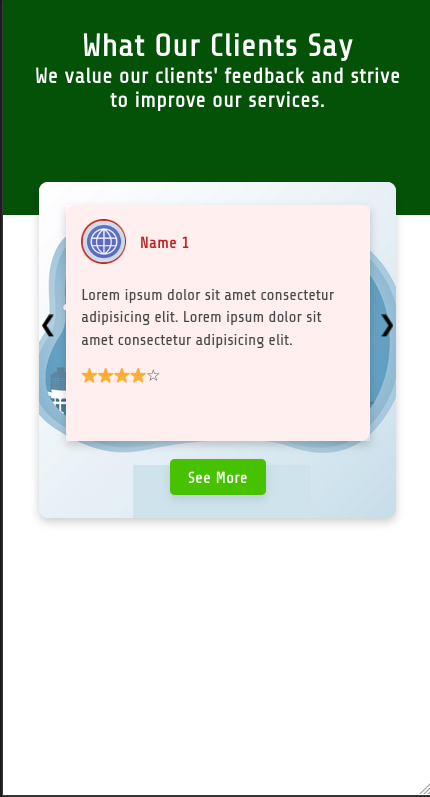

# Auto Sliding Review Section


A responsive and animated review/testimonial section built using **HTML**, **CSS**, and **JavaScript**. This component automatically cycles through client reviews with smooth transitions, dynamic backgrounds, and elegant animations. Ideal for portfolios, landing pages, and UI libraries.

---

## 📸 Preview

**Desktop View**  


**Mobile View**  


---

## 🚀 Live Demo

👉 _Coming soon_ 

---

## 📁 Folder Structure

```

REVIEW\_SECTION/
└── Auto Sliding Review Section/
├── 1.jpg                  # Profile image
├── dockerfile             # Docker container setup
├── index.html             # Main HTML file
├── Preview\_Mobile.png     # Mobile preview screenshot
├── Preview\_PC.png         # Desktop preview screenshot
├── Rbg1.png               # Background image 1
├── Rbg2.jpg               # Background image 2
├── Rbg3.jpg               # Background image 3
├── README.md              # Project documentation
├── script.js              # JS for slide logic and transitions
└── style.css              # CSS styles and responsiveness

````

---

## 📦 How to Use Locally

1. **Clone the repository or download the files**

```bash
git clone https://github.com/alamin72b/auto-sliding-review-section.git
cd "Auto Sliding Review Section"
````

2. **Open `index.html` directly in your browser**
   That’s it — the component is self-contained and dependency-free.

---

## 🐳 Docker Support

Run the review section inside a container using Python’s built-in HTTP server.

### 🔧 Build the Docker Image

```bash
docker build -t auto-review-section .
```

### ▶️ Run the Container

```bash
docker run -p 8000:8000 auto-review-section
```

Visit [http://localhost:8000](http://localhost:8000) in your browser.

---

## 🛠️ Customization

* **Background Image per Slide**
  Set using the `data-bg` attribute inside each `.slide` element in `index.html`.

* **Slide Interval Speed**
  In `script.js`, modify:

  ```js
  const intervalMs = 5000; // Slide every 5 seconds
  ```

* **Add More Testimonials**
  Duplicate any `.slide` block and update the image, name, and text.

---

## 💡 Use Cases

* Displaying customer testimonials on websites
* Landing page feedback sections
* Frontend/UI learning and animation practice
* Design systems or component libraries

---

## 📄 License

Released under the [MIT License](LICENSE).
Free to use, modify, and share — credit appreciated.

---

## 🔗 Part of WebCrumbs 🧩

This is a module from the [**WebCrumbs**](https://github.com/alamin72b/WebCrumbs-) component library — a growing collection of reusable HTML, CSS, and JavaScript UI blocks.


