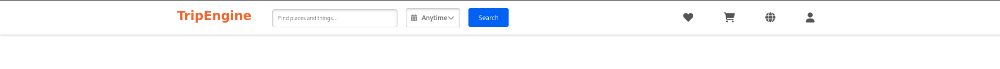
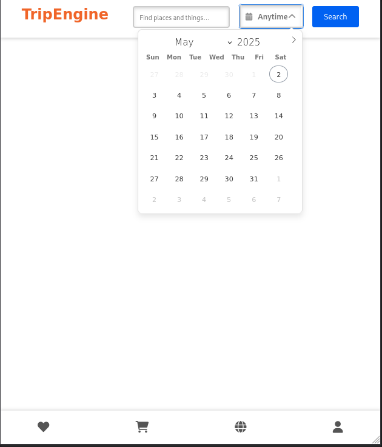

# Navbar: Search with Datepicker


A responsive and reusable navbar component featuring:
- 🔍 Search input
- 📅 Flatpickr datepicker
- 📱 Responsive layout with icons

---

## 📸 Preview

**Desktop View:**  


**Mobile View:**  


---

## 🚀 Live Demo

👉 [View on CodePen](https://codepen.io/pen?template=vEEdwYR)

---

## 📁 Included Files

- `index.html` – Main HTML structure
- `style.css` – Styling for the navbar
- `script.js` – JavaScript for Flatpickr and interaction
- `Dockerfile` – Docker support for containerized usage

---

## 📦 Local Usage

1. Clone this repo or download the files.
2. Open `index.html` in any browser.
3. CSS and JavaScript are already linked.

---

## 🐳 Docker Support

This project includes Docker support for quick deployment and testing.

### 🔧 Build the Docker Image

```bash
docker build -t navbar-search-datepicker .
````

### ▶️ Run the Container Locally

```bash
docker run -p 8000:8000 navbar-search-datepicker
```

Then visit [http://localhost:8000](http://localhost:8000) in your browser.

---

### 📦 Pull Prebuilt Image from Docker Hub

You can also pull and run the image directly:

```bash
docker pull almin72b/navbar-search-datepicker
docker run -p 8000:8000 almin72b/navbar-search-datepicker
```

---

## 📄 License

This project is open-source and available under the MIT License.

---

## 🔗 Related Projects

Part of a growing collection of reusable UI components.
